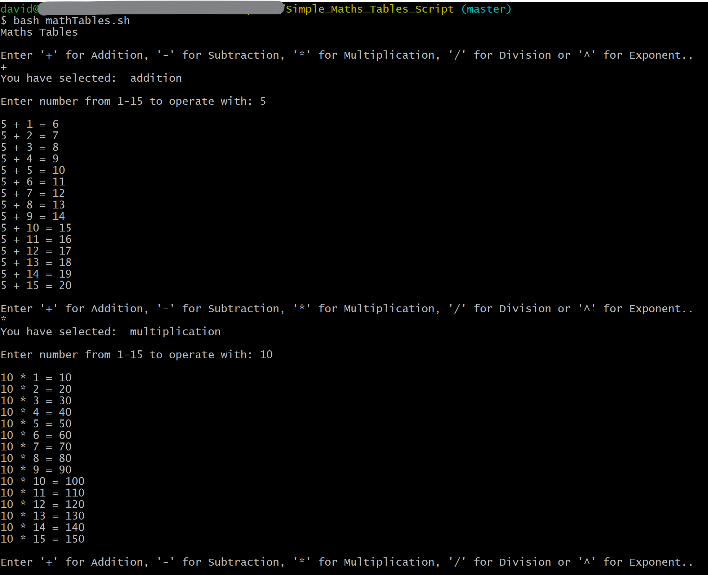

# Simple Math Tables

This shell script program generates math tables. This was created as part of my college project for Computer Architecture and Technology Convergence.

1. The user first selects between five operators by inputting the symbol that corresponds to the chosen operator as shown below:

    * Addition (+)
    * Subtraction (-)
    * Multiplication (*)
    * Division (/)
    * Exponent (^)

2. The user then inputs a number which will iterate against the chosen operator from 1 to 15.

----

See image below for sample output of math tables in bash terminal.

